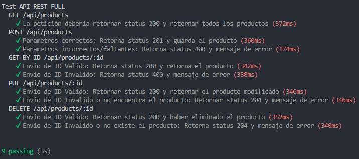

# Desafio 19 Curso Backend

## Testeamos nuestra API REST

## Comenzamos:

### Ejecutar el proyecto:

Para ejecutar el proyecto, el mismo puede descargarse como .zip o git clone.

[Clic aqui para descargar repo formato zip](https://github.com/matsanchez/desafio19-backend/archive/refs/heads/main.zip)

Copiar y pegar en la terminal :

```
git clone https://github.com/matsanchez/desafio19-backend.git
```

> Instalar las dependencias:

```
npm install
```

> Modos de ejecucion Local:
>
> > Usando process

```
node .\src\app.js port (numero) modo (cluster o fork)
"Ej: node .\src\app.js port 8020 modo fork"

node .\src\app.js (por defecto se conecta al puerto 8080 y modo fork)
```

> > Usando Nodemon

```
npm run dev (modo developer) Nodemon --- por defecto usa puerto: 8080
```

Crear el archivo .env con los datos correspondientes

```

# MONGODB ATLAS
MONGO_URI=

#NODEMAILER CONFIG
NODEMAILER_FROM=
NODEMAILER_PASS_APP=

#TWILIO CONFIG
TWILIO_ACCOUNT_SID=
TWILIO_AUTH_TOKEN=
TWILIO_PHONE_NUMBER=

#PERSISTENCE FACTORY
MOD_PERSISTENCE=
```

> > Para ejecutar el test con mocha y Supertest (api/products)

Aclaracion: El test ya tiene un producto de ejemplo, al momento de ejecutar, trae, crea, modifica y elimina el mismo producto de ejemplo. (de esta manera no se almacena de manera indiscriminada la base de datos.)

```
* En una consola pongan a correr el servidor con "npm run dev"
* En otro consola pongan a correr el test "npm run test"
```

> > Imagen de Resultado deseado



> > Usando AXIOS

Se debe realizar paso a paso de manera sincrona para su funcionamiento.

```
1) Ejecutar el comando "npm run axios-get" (trae todo los productos)
2) Ejecutar el comando "npm run axios-post" (crea un producto de ejemplo)
3) Ejecutar el comando "npm run axios-put" (modifica el producto)
4) Ejecutar el comando "npm run axios-delete" (elimina el producto)
```

```
Autor: Matias Sanchez
```
